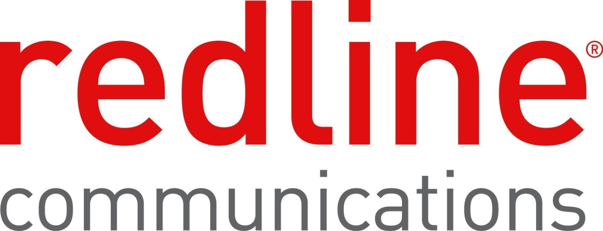

# ITU Challenge 34 Submission

## ITU-ML5G-PS-007: Lightning-Fast Modulation Classification with Hardware-Efficient Neural Networks

More information can be found here: [ITU-ML5G-PS-007](https://challenge.aiforgood.itu.int/match/matchitem/34)

# Red Gecko

**Red Gecko** team members and advisors from [Redline Communications](https://rdlcom.com/), Canada.

Members:

 - Brad Stimpson
 - Shahram Mollahasani
 - Armand Kamary

Advisors:

 - Alex Shatsky
 - Felix Dujmenovic
 - Ali Arad